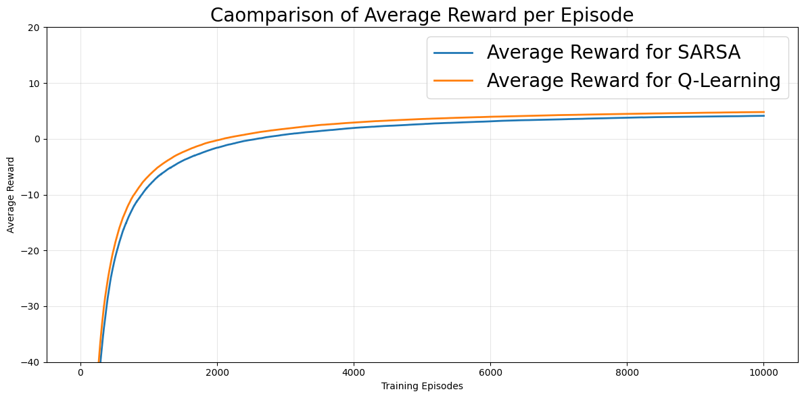

# Taxi Environment Reinforcement Learning Comparison

This project implements and compares two popular reinforcement learning algorithms (SARSA and Q-Learning) in the OpenAI Gymnasium Taxi-v3 environment. The goal is to evaluate their performance in learning optimal policies for the taxi pickup and dropoff task.

## Overview

The Taxi-v3 environment is a classic reinforcement learning problem where an agent must learn to navigate a grid world, pick up passengers, and drop them off at their destinations while avoiding obstacles. The environment consists of:
- A 5x5 grid with walls and obstacles
- 4 possible pickup/dropoff locations
- 5 passenger states (at different locations or in taxi)
- 4 destination locations
- Total of 500 possible states (5x5 grid × 5 passenger states × 4 destinations)

## Algorithms Implemented

### SARSA (State-Action-Reward-State-Action)
SARSA is an on-policy temporal difference learning algorithm that learns the value of state-action pairs by updating Q-values based on the actual policy being followed during learning.

### Q-Learning
Q-Learning is an off-policy temporal difference learning algorithm that learns the optimal Q-values by considering the maximum possible Q-value in the next state, regardless of the current policy.

## Dependencies

- gymnasium
- numpy
- matplotlib
- tqdm
- scipy

## Installation

```bash
pip install gymnasium numpy matplotlib tqdm scipy
```

## Usage

1. Open the `taxi.ipynb` Jupyter notebook
2. Run all cells in sequence to:
   - Set up the Taxi environment
   - Train both SARSA and Q-Learning agents
   - Generate learning curves and performance plots
   - Perform statistical analysis on the results

## Key Parameters

- **Alpha (α)**: Learning rate = 0.5
- **Gamma (γ)**: Discount factor = 1.0
- **Epsilon (ε)**: Exploration rate = 0.1
- **Episodes**: 10,000 training episodes
- **Test Trials**: 1,000 evaluation episodes

## Results


### SARSA Algorithm
The SARSA algorithm demonstrates effective learning behavior where the average reward per episode increases with longer training. The algorithm shows stable convergence with relatively low variance in episode rewards.

### Q-Learning Algorithm
Similarly, the Q-Learning algorithm demonstrates learning in the Taxi environment, achieving higher average rewards during training compared to SARSA.

### Comparison



The analysis reveals several key findings:

1. **Average Reward**: Q-Learning achieves higher average reward per episode during training
2. **Variance**: SARSA exhibits significantly lower variance in total rewards compared to Q-Learning
3. **Stability**: Q-Learning's training process is less stable due to higher variance
4. **Convergence**: Both algorithms converge to similar optimal policy performance levels

### Testing Results

When evaluating the learned policies in a testing environment:
- SARSA performs equally or significantly better than Q-Learning on all metrics except average reward
- The lower variance of SARSA leads to more consistent performance
- Q-Learning's riskier exploration strategy, while beneficial during training, results in less stable test performance

## Key Insights

These results suggest that while Q-Learning's more aggressive exploration leads to better training performance, its learned optimal policy performs worse in testing scenarios. SARSA's more conservative approach results in:
- Lower variance during training
- More stable convergence
- Better generalization to unseen scenarios
- Superior performance in the Taxi environment's design, which lacks catastrophic failure states

The findings imply that SARSA's balanced exploration-exploitation strategy is particularly well-suited for environments where stability and consistent performance are prioritized over maximum training rewards.

## Statistical Analysis

The project includes comprehensive statistical testing:
- Independent t-tests for mean reward comparisons
- Levene's test for variance equality
- One-sided tests to assess significance of variance differences
- Confidence intervals for performance metrics

## Visualization

The notebook generates several plots:
- Learning curves with moving averages
- Cumulative average reward progression
- Performance comparison plots
- Reward distribution histograms

## Conclusion

This comparison highlights the trade-offs between on-policy (SARSA) and off-policy (Q-Learning) reinforcement learning approaches. While Q-Learning may achieve higher training rewards through more aggressive exploration, SARSA often provides more reliable and stable performance, particularly in environments where consistent behavior is crucial.

The Taxi-v3 environment serves as an excellent benchmark for understanding these algorithmic differences, demonstrating how the choice of reinforcement learning algorithm can significantly impact both training dynamics and final policy performance.